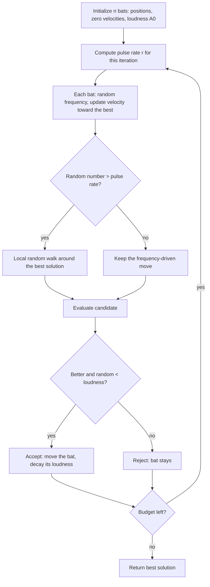

# Bat Algorithm (BA)

**BA** (Yang, 2010) is inspired by the echolocation of microbats. Each
bat flies through the search space toward the best solution found so
far, tuning its **frequency** — which sets its step size — at random.
Two further controls mimic real foraging: the **pulse rate** rises as
the hunt closes in, increasingly triggering fine local searches, while
the **loudness** falls each time a bat accepts a catch, making it
progressively pickier.

## Flowchart



## Equations

**1. Frequency and movement.** Each bat \(i\) draws a frequency and
accelerates toward the best solution \(x^{*}\):

\[
f_i \sim \mathcal{U}(f_{\min}, f_{\max}), \qquad
v_i \leftarrow v_i + \bigl(x^{*} - x_i\bigr) f_i, \qquad
x_i^{\text{new}} = x_i + v_i
\]

Because \(f_i\) is redrawn every iteration, each bat effectively uses
its own step size, and the swarm covers a range of scales at once.

**2. Pulse rate and local search.** The emission rate grows toward
\(r_0\) over iterations \(t\):

\[
r^{(t)} = r_0 \left(1 - e^{-\gamma t}\right)
\]

With probability \(1 - r^{(t)}\) the bat abandons its flight path and
instead samples near the best solution:

\[
x^{\text{new}} = x^{*} + \epsilon\,s^{(t)}\,(\text{upper} - \text{lower}),
\qquad \epsilon \sim \mathcal{N}(0, 1)
\]

Early on, local searches are frequent; as \(r^{(t)} \to r_0\) they
become rarer and the swarm relies on flight again.

**3. Acceptance and loudness decay.** A candidate is accepted only if
it is at least as good *and* a loudness test passes:

\[
\text{if } f(x^{\text{new}}) \le f(x_i) \ \text{and}\ \mathcal{U}(0,1) < A_i:
\quad x_i \leftarrow x^{\text{new}}, \quad A_i \leftarrow \alpha A_i
\]

Loudness starts at \(A_0\) and decays geometrically with \(\alpha < 1\),
so acceptance becomes stricter as the search matures.

**4. Step decay (implementation refinement).** The local-walk scale is
tied to the remaining budget,

\[
s^{(t)} = s_0 \max\!\left(1 - \frac{\text{evals}}{\text{max\_evals}},\;
10^{-3}\right)
\]

so early walks explore widely and late ones refine. This is an addition
to Yang's original formulation, adopted here after benchmarking showed
the fixed-scale version stalling.

## Pseudocode

```text
input: bats n, loudness A0, pulse rate r0, alpha, gamma,
       frequency range [f_min, f_max], local scale s0
x   <- n uniform random solutions, evaluated
v   <- zeros
A   <- A0 for every bat

repeat until the budget is exhausted:
    r <- r0 * (1 - exp(-gamma * iteration))                    (eq. 2)
    s <- s0 * max(1 - evals / max_evals, 1e-3)                 (eq. 4)

    for i = 1 .. n:
        f      <- Uniform(f_min, f_max)
        v[i]   <- v[i] + (best - x[i]) * f                     (eq. 1)
        cand   <- x[i] + v[i]
        if Uniform(0,1) > r:
            cand <- best + s * Normal(0, 1) * (upper - lower)  (eq. 2)
        cand   <- repair(cand)
        if evaluate(cand) <= f[i] and Uniform(0,1) < A[i]:     (eq. 3)
            x[i] <- cand
            A[i] <- alpha * A[i]

return best solution found
```

## Parameters

| Parameter | Symbol | Default | Effect |
|---|---|---|---|
| `population_size` | \(n\) | 30 | Number of bats |
| `loudness` | \(A_0\) | 1.0 | Initial acceptance probability |
| `pulse_rate` | \(r_0\) | 0.5 | Final local-search rate |
| `alpha` | \(\alpha\) | 0.9 | Loudness decay per accepted move |
| `gamma` | \(\gamma\) | 0.9 | How fast the pulse rate grows |
| `min_frequency`, `max_frequency` | \(f_{\min}, f_{\max}\) | 0.0, 2.0 | Step-size range |
| `local_scale` | \(s_0\) | 0.05 | Initial local-walk width |
| `seed` | — | `None` | Reproducibility |

## Behavior

BA lands mid-field on the benchmarks (Sphere ~4e-05, Ackley ~0.045,
Rastrigin ~31): the pull toward a single best solution makes it
converge quickly but also makes it prone to settling in one basin.
Two deviations from the 2010 paper proved necessary in benchmarking and
are documented in the source: velocities point **toward** the best
solution, and the local-walk scale decays with the budget (equation 4).

```python
from ikn_library import Task
from ikn_library.problems import Ackley
from ikn_library.algorithms import BatAlgorithm

task = Task(problem=Ackley(dimension=10), max_evals=20000)
algo = BatAlgorithm(population_size=30, seed=42)
best_x, best_fitness = algo.run(task)
```

## References

- X.-S. Yang, "A new metaheuristic bat-inspired algorithm," in *Nature
  Inspired Cooperative Strategies for Optimization (NICSO 2010)*,
  Studies in Computational Intelligence 284, Springer, 65-74, 2010.
  [doi:10.1007/978-3-642-12538-6_6](https://doi.org/10.1007/978-3-642-12538-6_6).
- X.-S. Yang and A. H. Gandomi, "Bat algorithm: a novel approach for
  global engineering optimization," *Engineering Computations*, 29(5),
  464-483, 2012.
  [doi:10.1108/02644401211235834](https://doi.org/10.1108/02644401211235834).
