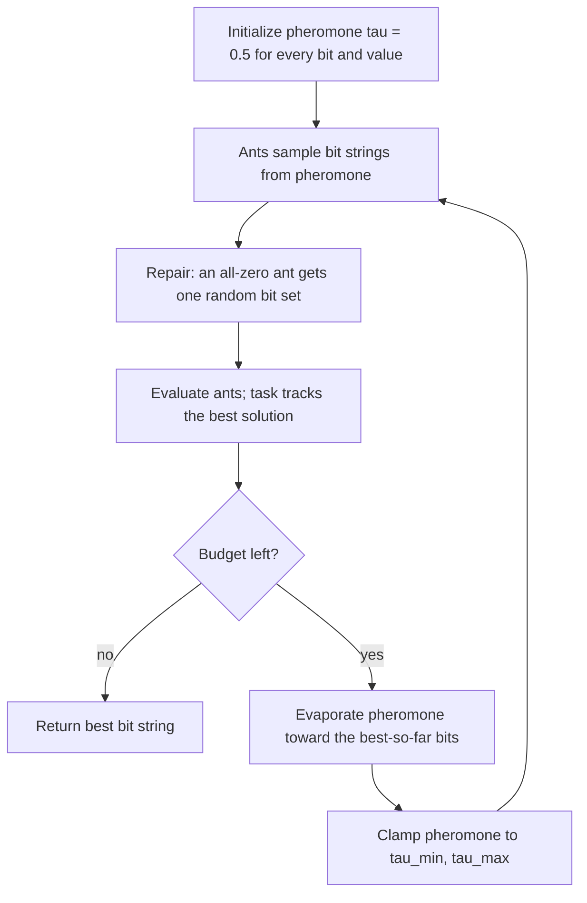

# Binary Ant Colony Optimization

Where [ACO-R](aco.md) adapts ant colony optimization to continuous
spaces, **Binary ACO** keeps the search discrete: every variable is one
**bit**, and the pheromone table stores, for each variable, how
attractive the values 0 and 1 are. It is the algorithm behind this
library's [feature selection](../feature-selection.md), ensemble
pruning, and [undersampling](../undersampling.md).

## Flowchart



## Equations

**1. Construction probability.** For variable \(i\), with pheromone
\(\tau_{i,0}\) and \(\tau_{i,1}\), an ant sets bit \(i\) to 1 with

\[
p_{i} = \frac{\tau_{i,1}^{\alpha}}
              {\tau_{i,0}^{\alpha} + \tau_{i,1}^{\alpha}}
\]

The exponent \(\alpha\) sharpens (\(\alpha > 1\)) or flattens
(\(\alpha < 1\)) the influence of pheromone.

**2. Hyper-cube pheromone update.** After each iteration the pheromone
moves toward the best solution found so far, \(x^{\text{best}}\), at
learning rate \(\rho\) (`evaporation`):

\[
\tau_{i,v} \leftarrow (1-\rho)\,\tau_{i,v} + \rho\,\delta_{i,v},
\qquad
\delta_{i,v} =
\begin{cases}
1 & \text{if } x_i^{\text{best}} = v\\
0 & \text{otherwise}
\end{cases}
\]

This is the *hyper-cube framework*: pheromone values stay bounded in
\([0,1]\) automatically, independent of the fitness scale.

**3. Pheromone limits.** Values are clamped,

\[
\tau_{i,v} \leftarrow \min\!\big(\max(\tau_{i,v},\, \tau_{\min}),\,
\tau_{\max}\big)
\]

so no bit can ever reach probability 0 or 1 — the mechanism that keeps
the colony exploring (as in MAX-MIN Ant System).

## Pseudocode

```text
input: ants m, evaporation rho, alpha, tau_min, tau_max
tau[i][v] <- 0.5 for every variable i and value v in {0, 1}

repeat until the budget is exhausted:
    for a = 1 .. m:
        for each variable i:
            ant[a][i] <- 1 with probability p_i                (eq. 1)
        if ant[a] is all zeros:
            set one random bit to 1                # empty subset repair
        evaluate(ant[a])                           # task tracks the best

    delta <- one-hot encoding of the best-so-far solution
    tau   <- (1 - rho) * tau + rho * delta                     (eq. 2)
    tau   <- clip(tau, tau_min, tau_max)                       (eq. 3)

return best bit string found
```

## Parameters

| Parameter | Symbol | Default | Effect |
|---|---|---|---|
| `population_size` | \(m\) | 30 | Ants per iteration |
| `evaporation` | \(\rho\) | 0.1 | Learning rate toward the best solution |
| `alpha` | \(\alpha\) | 1.0 | Pheromone exponent (selection sharpness) |
| `tau_min` | \(\tau_{\min}\) | 0.1 | Lower limit — guarantees exploration |
| `tau_max` | \(\tau_{\max}\) | 0.9 | Upper limit |
| `seed` | — | `None` | Reproducibility |

## The empty-subset repair

For subset problems an all-zero string is meaningless (no features
selected, no ensemble members kept). Rather than wasting an evaluation
on it, the implementation switches one random bit on. This is a small
deviation from textbook ACO, made explicit here because it changes the
reachable search space slightly.

```python
from ikn_library import Task
from ikn_library.problems import FeatureSelectionProblem
from ikn_library.algorithms import BinaryAntColonyOptimization

task = Task(problem=FeatureSelectionProblem(X, y, cv=5), max_evals=1000)
algo = BinaryAntColonyOptimization(population_size=20, evaporation=0.1, seed=42)
best_x, best_fitness = algo.run(task)
```

## References

- M. Dorigo and T. Stützle, *Ant Colony Optimization*, MIT Press, 2004
  (binary/subset formulations and the general framework).
- C. Blum and M. Dorigo, "The hyper-cube framework for ant colony
  optimization," *IEEE Transactions on Systems, Man, and Cybernetics,
  Part B*, 34(2), 1161-1172, 2004.
  [doi:10.1109/TSMCB.2003.821450](https://doi.org/10.1109/TSMCB.2003.821450).
- T. Stützle and H. H. Hoos, "MAX-MIN Ant System," *Future Generation
  Computer Systems*, 16(8), 889-914, 2000
  (the pheromone-limit idea used in equation 3).
  [doi:10.1016/S0167-739X(00)00043-1](https://doi.org/10.1016/S0167-739X(00)00043-1).
