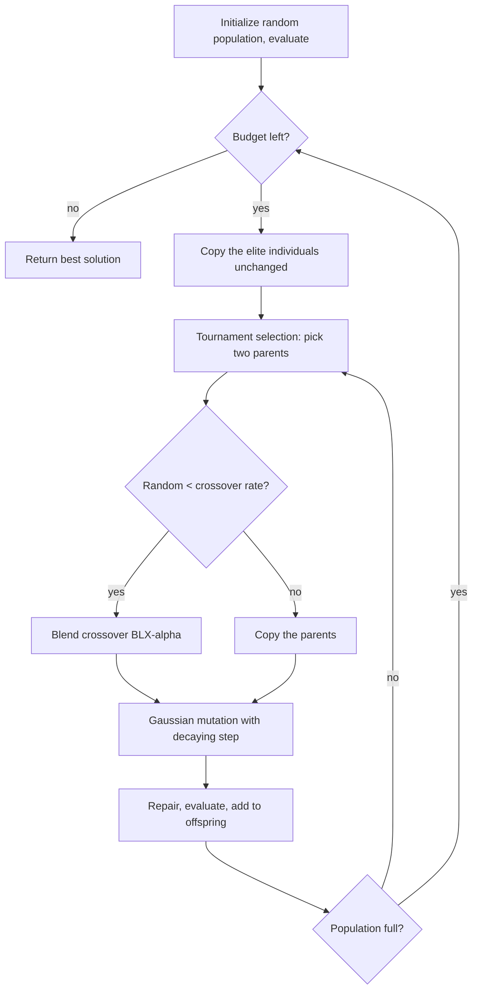

# Genetic Algorithm (GA)

A **GA** (Holland, 1975) evolves a population the way natural selection
shapes a species: fitter individuals are more likely to reproduce,
offspring recombine their parents' traits, and occasional mutations
introduce new variation. This library implements a **real-coded** GA —
genes are floating-point numbers rather than bits — using tournament
selection, blend crossover, and Gaussian mutation with elitism.

## Flowchart



## Equations

**1. Tournament selection.** Draw \(k\) individuals at random
(`tournament_size`) and keep the best:

\[
\text{parent} = \arg\min_{i \in S} f(x_i),
\qquad S \subset \{1,\dots,N\},\ |S| = k
\]

Larger \(k\) means stronger selection pressure — faster convergence,
less diversity.

**2. Blend crossover (BLX-\(\alpha\)).** For each gene \(d\), let
\(u = \min(p^1_d, p^2_d)\) and \(w = \max(p^1_d, p^2_d)\). Children are
sampled from an interval widened by \(\alpha\) on both sides:

\[
c_d \sim \mathcal{U}\Bigl(u - \alpha (w - u),\;\; w + \alpha (w - u)\Bigr)
\]

The widening is what lets a GA explore *outside* the range its parents
span, instead of only interpolating between them.

**3. Gaussian mutation with a decaying step.** Each gene mutates with
probability \(p_m\) (default \(1/\text{dim}\), so roughly one gene per
child):

\[
c_d \leftarrow c_d + \mathcal{N}\!\left(0,\; \sigma^{(t)}
(\text{upper}_d - \text{lower}_d)\right),
\qquad
\sigma^{(t)} = \sigma_0 \max\!\left(1 - \frac{\text{evals}}{\text{max\_evals}},\ 10^{-3}\right)
\]

The linear decay (non-uniform mutation) makes early generations explore
and late generations refine — without it this GA stalls at ~1e-2 on
Sphere instead of reaching ~1e-4.

**4. Elitism.** The best \(e\) individuals are copied into the next
generation untouched, so the population's best fitness can never get
worse.

## Pseudocode

```text
input: population N, crossover rate pc, mutation rate pm,
       mutation scale sigma0, tournament size k, blend alpha, elites e
P <- N uniform random solutions, evaluated

repeat until the budget is exhausted:
    sigma    <- sigma0 * max(1 - evals / max_evals, 1e-3)      (eq. 3)
    offspring <- the e best individuals of P                   (eq. 4)

    while offspring is not full:
        p1, p2 <- tournament selection, twice                  (eq. 1)
        if Uniform(0,1) < pc:
            c1, c2 <- blend crossover of p1, p2                (eq. 2)
        else:
            c1, c2 <- copies of p1, p2
        for each child c:
            c <- repair(mutate(c, pm, sigma))                  (eq. 3)
            evaluate(c) and append to offspring

    P <- offspring

return best solution found
```

## Parameters

| Parameter | Symbol | Default | Effect |
|---|---|---|---|
| `population_size` | \(N\) | 50 | Individuals per generation |
| `crossover_rate` | \(p_c\) | 0.9 | Chance a selected pair recombines |
| `mutation_rate` | \(p_m\) | \(1/\text{dim}\) | Per-gene mutation probability |
| `mutation_scale` | \(\sigma_0\) | 0.1 | Initial mutation width (fraction of range) |
| `tournament_size` | \(k\) | 2 | Selection pressure |
| `blend_alpha` | \(\alpha\) | 0.5 | Crossover interval widening |
| `elitism` | \(e\) | 1 | Individuals carried over untouched |
| `seed` | — | `None` | Reproducibility |

## Behavior

GA is this library's **multimodal specialist after ABC**: on Rastrigin
it reaches ~3.0 where ACO-R, SA, and BA all stall near 27-31. Crossover
between individuals sitting in *different* local basins can produce a
child in a third, better basin — a move no single-solution method can
make. Its precision on smooth functions is more modest (Sphere ~1e-4),
since recombination keeps injecting variation.

```python
from ikn_library import Task
from ikn_library.problems import Rastrigin
from ikn_library.algorithms import GeneticAlgorithm

task = Task(problem=Rastrigin(dimension=10), max_evals=20000)
algo = GeneticAlgorithm(population_size=50, seed=42)
best_x, best_fitness = algo.run(task)
```

## References

- J. H. Holland, *Adaptation in Natural and Artificial Systems*,
  University of Michigan Press, 1975.
- L. J. Eshelman and J. D. Schaffer, "Real-coded genetic algorithms and
  interval-schemata," in *Foundations of Genetic Algorithms 2*,
  187-202, 1993 (the BLX-\(\alpha\) crossover of equation 2).
  [doi:10.1016/B978-0-08-094832-4.50018-0](https://doi.org/10.1016/B978-0-08-094832-4.50018-0).
- D. E. Goldberg, *Genetic Algorithms in Search, Optimization, and
  Machine Learning*, Addison-Wesley, 1989.
- Z. Michalewicz, *Genetic Algorithms + Data Structures = Evolution
  Programs*, Springer, 3rd ed., 1996 (non-uniform mutation, equation 3).
