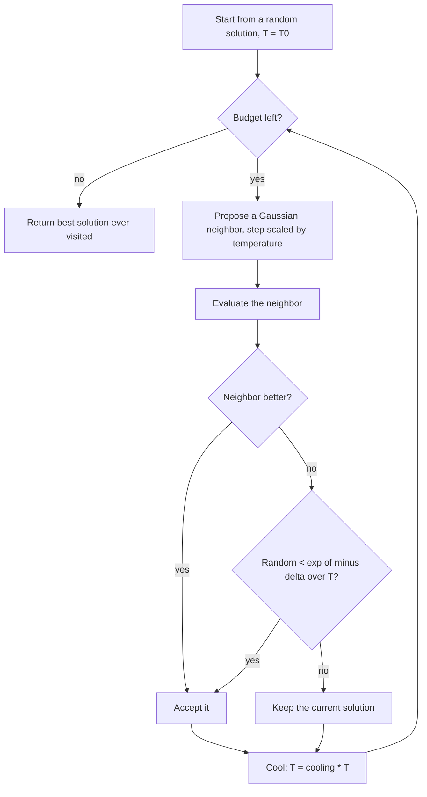

# Simulated Annealing (SA)

**SA** (Kirkpatrick, Gelatt & Vecchi, 1983) borrows from metallurgy:
cooling a metal slowly lets its atoms settle into a low-energy crystal,
while quenching traps defects. The algorithm mirrors that — it starts
"hot", accepting even *worse* solutions so it can climb out of local
optima, and gradually cools until it only accepts improvements. It is
the only **single-solution** algorithm in this library, which makes it
a useful cheap baseline against the population-based ones.

## Flowchart



## Equations

**1. Neighbor proposal.** A candidate is drawn around the current
solution, with a width that shrinks as the system cools:

\[
x^{\text{new}} = x + \mathcal{N}\!\left(0,\;
s_0 \sqrt{\tfrac{T}{T_0}}\,(\text{upper} - \text{lower})\right)
\]

The \(\sqrt{T/T_0}\) coupling is an implementation refinement (see
below), keeping proposals large while hot and fine while cold.

**2. Metropolis acceptance criterion.** With
\(\Delta = f(x^{\text{new}}) - f(x)\):

\[
P(\text{accept}) =
\begin{cases}
1 & \Delta < 0 \quad (\text{better}) \\[1ex]
\exp\!\left(-\dfrac{\Delta}{T}\right) & \Delta \ge 0 \quad (\text{worse})
\end{cases}
\]

This is the heart of SA. At high \(T\), \(\exp(-\Delta/T) \approx 1\)
and almost every uphill move is taken; as \(T \to 0\) the exponent
explodes and the search becomes purely greedy.

**3. Geometric cooling schedule.**

\[
T^{(t+1)} = \beta\, T^{(t)}, \qquad 0 < \beta < 1
\]

so \(T^{(t)} = \beta^{t} T_0\) decays exponentially. Values of \(\beta\)
close to 1 (e.g. 0.999) cool slowly and explore longer.

!!! note "Wandering never loses the best solution"
    SA's current solution can move *downhill in quality* by design. The
    best solution ever visited is nevertheless kept safe: `task.eval`
    records it on every evaluation, so the final answer is never worse
    than the best point seen.

## Pseudocode

```text
input: initial temperature T0, cooling beta, step size s0
x  <- one uniform random solution
fx <- evaluate(x)
T  <- T0

repeat until the budget is exhausted:
    scale <- s0 * sqrt(T / T0)
    cand  <- repair(x + Normal(0, scale * (upper - lower)))     (eq. 1)
    fc    <- evaluate(cand)

    if fc < fx:                                    # better: always accept
        x, fx <- cand, fc
    else:                                          # worse: sometimes accept
        delta <- fc - fx
        if Uniform(0,1) < exp(-delta / T):                      (eq. 2)
            x, fx <- cand, fc

    T <- beta * T                                               (eq. 3)

return best solution ever evaluated
```

## Parameters

| Parameter | Symbol | Default | Effect |
|---|---|---|---|
| `initial_temperature` | \(T_0\) | 1.0 | Set relative to typical fitness differences; higher = more uphill moves early |
| `cooling` | \(\beta\) | 0.995 | Decay per iteration; closer to 1 = slower cooling, more exploration |
| `step_size` | \(s_0\) | 0.1 | Initial neighbor width (fraction of the bound range) |
| `seed` | — | `None` | Reproducibility |

Because SA evaluates one candidate per iteration, a budget of
`max_evals=20000` gives it 20,000 iterations — far more cooling steps
than a population method gets, which is why \(\beta\) is usually set
very close to 1 for long runs.

## Behavior

With the temperature-coupled step (equation 1) SA polishes smooth
landscapes well (Sphere ~8e-13, Ackley ~8e-06) but struggles on
Rastrigin (~27): a single walker, however hot, explores a
high-dimensional multimodal space far less effectively than a
population. The textbook fixed-step version performed far worse
(Sphere 0.72), which is why the coupling was adopted.

```python
from ikn_library import Task
from ikn_library.problems import Sphere
from ikn_library.algorithms import SimulatedAnnealing

task = Task(problem=Sphere(dimension=10), max_evals=20000)
algo = SimulatedAnnealing(initial_temperature=1.0, cooling=0.9995, seed=42)
best_x, best_fitness = algo.run(task)
```

## References

- S. Kirkpatrick, C. D. Gelatt, and M. P. Vecchi, "Optimization by
  simulated annealing," *Science*, 220(4598), 671-680, 1983.
  [doi:10.1126/science.220.4598.671](https://doi.org/10.1126/science.220.4598.671).
- N. Metropolis, A. W. Rosenbluth, M. N. Rosenbluth, A. H. Teller, and
  E. Teller, "Equation of state calculations by fast computing
  machines," *The Journal of Chemical Physics*, 21(6), 1087-1092, 1953
  (the acceptance criterion of equation 2).
  [doi:10.1063/1.1699114](https://doi.org/10.1063/1.1699114).
- V. Černý, "Thermodynamical approach to the traveling salesman
  problem: an efficient simulation algorithm," *Journal of Optimization
  Theory and Applications*, 45(1), 41-51, 1985.
  [doi:10.1007/BF00940812](https://doi.org/10.1007/BF00940812).
