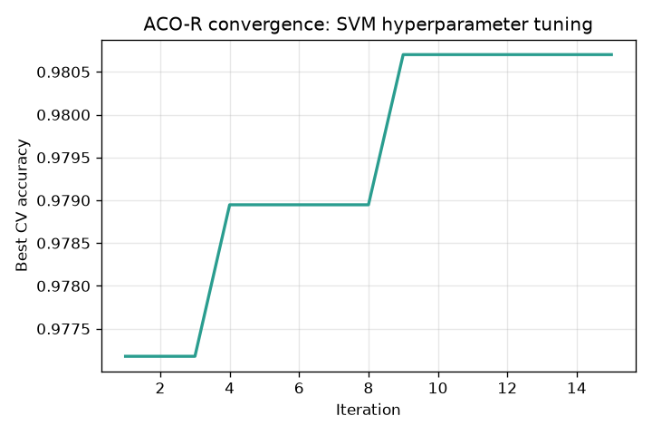

# Plotting Convergence

A *convergence curve* shows the best objective value found so far after
each iteration of a metaheuristic. It is the primary diagnostic for an
optimization run: it tells you whether the algorithm is still improving
or has stalled — and therefore whether your evaluation budget was spent
well.

## Getting the data

Every `Task` records the best score after each iteration automatically;
no extra bookkeeping is needed. After a run (here, the SVM tuning task
from the [Parameter Optimization](parameter-optimization.md) tutorial):

```python
iters, scores = task.convergence_data()

import matplotlib.pyplot as plt
plt.plot(iters, scores)
plt.xlabel("Iteration")
plt.ylabel("Best CV accuracy")
plt.show()
```

`convergence_data()` returns two arrays: the iteration numbers and the
best score at the end of each iteration, expressed in the problem's
original sense (so for a maximization task the curve goes up).

## Example output

Running the SVM tuning task (`max_evals=150`, ACO-R with
`population_size=10`, `seed=42`) produces:



## How to read the curve

- **It never goes down.** The curve tracks the *best-so-far* score, so
  it is monotone by construction — a drop would indicate a bug, not bad
  luck.
- **Steps, not slopes.** Improvements arrive as jumps whenever some ant
  finds a better solution; flat stretches mean iterations passed
  without a new best.
- **The plateau is the signal.** In the example, most of the gain
  (0.9772 -> 0.9807) arrives in the first few iterations and the curve
  flattens well before the budget runs out. A long final plateau
  suggests the budget could be reduced — or, if you expected a better
  score, that the algorithm needs more exploration (e.g. a larger
  population or archive) rather than more iterations.
- **Compare runs fairly.** When comparing algorithms or settings, plot
  their curves against *evaluations* used, not wall-clock time, and use
  the same seed policy — otherwise the comparison mixes convergence
  behavior with implementation speed.

!!! tip "Where does the starting point come from?"
    The curve starts high already at iteration 1 because the initial
    population is evaluated before the first iteration — with 10+
    random candidates, the best of them is usually far better than a
    single random guess.
