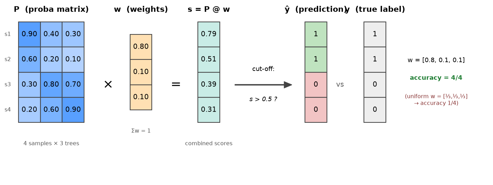

# Ensemble Weights Concept

This note explains the idea behind
[ensemble weight optimization](ensemble.md) with a small worked
example: how a probability matrix and a weight vector combine into
final predictions — and why the weights matter.

## From majority voting to weighted voting

A Random Forest normally decides by **majority voting**: every tree
gets one equal vote. Weighted voting generalizes this — each tree
gets a weight, and trees that are more reliable get a larger say.
The whole mechanism is one matrix multiplication and one cut-off.

## Step 1 — the probability matrix `P`

Each of the 3 trees outputs, for each of the 4 samples, its estimated
probability that the sample belongs to class 1. Collected into a
matrix, one **row per sample**, one **column per tree**:

|       | tree 1 | tree 2 | tree 3 |
|-------|--------|--------|--------|
| s1    | 0.90   | 0.40   | 0.30   |
| s2    | 0.60   | 0.20   | 0.10   |
| s3    | 0.30   | 0.80   | 0.70   |
| s4    | 0.20   | 0.60   | 0.90   |

Reading a **column** top to bottom shows one tree's opinion about every
sample; reading a **row** left to right shows every tree's opinion
about one sample. Here tree 1 is a good judge (high for s1, s2 — the
true class-1 samples — low for s3, s4), while trees 2 and 3 have it
backwards.

## Step 2 — the weight vector `w`

One weight per tree, non-negative and summing to 1 (so the combined
score stays in `[0, 1]` and the cut-off keeps its meaning):

```
w = [0.8, 0.1, 0.1]
```

## Step 3 — the multiplication `s = P @ w`

Each sample's combined score is the weighted average of its row. For
sample s1:

```
s1 = 0.90×0.8 + 0.40×0.1 + 0.30×0.1 = 0.72 + 0.04 + 0.03 = 0.79
```

Doing this for every row is exactly the matrix product `P @ w`:

```
s = [0.79, 0.51, 0.39, 0.31]
```

## Step 4 — the cut-off

A score above 0.5 predicts class 1, otherwise class 0:

```
ŷ = (s > 0.5)  →  [1, 1, 0, 0]
```

The full pipeline in one picture:



## Why the weights matter

Compare against the true labels `y = [1, 1, 0, 0]`:

| Weights | Scores `P @ w` | Predictions | Accuracy |
|---|---|---|---|
| uniform `[1/3, 1/3, 1/3]` | `[0.53, 0.30, 0.60, 0.57]` | `[1, 0, 1, 1]` | **1/4** |
| `[0.8, 0.1, 0.1]` | `[0.79, 0.51, 0.39, 0.31]` | `[1, 1, 0, 0]` | **4/4** |

With **uniform weights** — which is plain soft majority voting — the
two misleading trees outvote the good one, and 3 of 4 samples are
misclassified. Shifting the weight toward the reliable tree flips all
three wrong predictions. Same trees, same probabilities; only the
weights changed.

## Where the metaheuristic comes in

In this toy example we could see by eye that tree 1 deserves the
weight. With 100 trees and hundreds of samples, nobody can — so the
weight vector becomes a **continuous optimization problem**: find the
`w` that maximizes a classification metric on data the trees were not
trained on. That is exactly what
[`EnsembleWeightProblem`](api.md#ensemble) defines, and any continuous
algorithm in this library (e.g. ACO-R) can search it. The practical
workflow, the train/validation/test protocol, and the literature
reference are on the [Ensemble Weights](ensemble.md) page.

Two closing observations that carry over to the real setting:

- Uniform weights are always **inside** the search space, so the
  optimized ensemble can never be worse than soft majority voting *on
  the data used for optimization* — the safeguard is evaluating on a
  separate test set.
- Setting a weight to **zero** removes a tree entirely; restricting
  all weights to 0/1 turns the same mechanism into **ensemble
  pruning**.
