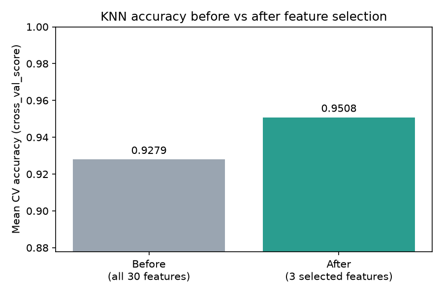

# Feature Selection

`FeatureSelectionProblem` implements wrapper-based feature selection: an
optimizer searches for the feature subset that maximizes a cross-validated
model score while keeping the subset small.

Requires scikit-learn:

```bash
pip install "ikn-library[ml]"
```

## Example

```python
from sklearn.datasets import load_breast_cancer
from sklearn.neighbors import KNeighborsClassifier

from ikn_library import Task
from ikn_library.problems import FeatureSelectionProblem
from ikn_library.algorithms import BinaryAntColonyOptimization

X, y = load_breast_cancer(return_X_y=True)

problem = FeatureSelectionProblem(
    X, y,
    estimator=KNeighborsClassifier(n_neighbors=5),
    cv=5,
    scoring="accuracy",
    alpha=0.99,
)
task = Task(problem=problem, max_evals=1000)
algo = BinaryAntColonyOptimization(population_size=20, evaporation=0.1, seed=42)
best_x, best_fitness = algo.run(task)

print("Selected features:", problem.selected_features(best_x))
```

On the breast-cancer dataset this typically selects a handful of features
while *improving* the cross-validated accuracy over using all 30.

## Before vs after: comparing with `cross_val_score`

To quantify what the selection achieved, evaluate the **same model**
with the **same cross-validation** twice — once on all features, once on
the selected subset — and compare the mean scores. Continuing from the
example above:

```python
from sklearn.model_selection import cross_val_score

model = KNeighborsClassifier(n_neighbors=5)
selected = problem.selected_features(best_x)

score_all = cross_val_score(model, X, y, cv=5).mean()
score_selected = cross_val_score(model, X[:, selected], y, cv=5).mean()

print(f"Before (all {X.shape[1]} features)   : cross_val_score = {score_all:.4f}")
print(f"After  ({len(selected)} selected features) : cross_val_score = {score_selected:.4f}")
```

Output:

```text
Before (all 30 features)   : cross_val_score = 0.9279
After  (3 selected features) : cross_val_score = 0.9508
```

The comparison as a bar chart, with each bar labelled by its score:

```python
import matplotlib.pyplot as plt

scores_all = cross_val_score(model, X, y, cv=5)
scores_selected = cross_val_score(model, X[:, selected], y, cv=5)

labels = [f"Before\n(all {X.shape[1]} features)",
          f"After\n({len(selected)} selected features)"]
means = [scores_all.mean(), scores_selected.mean()]

fig, ax = plt.subplots(figsize=(6, 4))
bars = ax.bar(labels, means, color=["#9aa5b1", "#2a9d8f"])
ax.set_ylabel("Mean CV accuracy (cross_val_score)")
ax.set_ylim(min(means) - 0.05, 1.0)
ax.bar_label(bars, fmt="%.4f", padding=3)
ax.set_title("KNN accuracy before vs after feature selection")
fig.tight_layout()
plt.show()
```

The result:



The selected subset wins on both axes: higher accuracy (+2.3 points)
with 10x fewer features. The spread across the five folds is 0.0218
before and 0.0143 after, so the gain is close to one fold-standard-
deviation — real, but worth reporting alongside that spread rather than
on its own. Two things make this a fair comparison:

- **Same estimator, same folds**: both scores come from an identical
  5-fold cross-validation of an identical model — the only difference
  is the feature set.
- **Fewer features can genuinely help**: distance-based models like KNN
  suffer from irrelevant dimensions, so removing noisy features often
  improves the score rather than merely matching it.

!!! note "For a fully unbiased estimate"
    The optimizer used these same CV scores as its fitness, so the
    "after" number is slightly optimistic (selection bias). For a
    publication-grade comparison, hold out a test set before running
    the selection and report both models on it — the same three-split
    discipline described in
    [Ensemble Weights](ensemble.md#the-protocol-three-splits).

## The fitness function

The fitness (minimized) balances score quality against subset size:

```
alpha * (1 - cv_score) + (1 - alpha) * n_selected / n_features
```

- `alpha` close to 1 prioritizes the model score.
- Lower `alpha` presses harder for smaller subsets.
- An empty subset receives the worst possible fitness (1.0).

This weighted formulation is standard in the wrapper feature-selection
literature — see E. Emary, H. M. Zawbaa, and A. E. Hassanien, "Binary
grey wolf optimization approaches for feature selection,"
*Neurocomputing*, 172, 371–381, 2016; the same form is used in J. Too's
[Wrapper-Feature-Selection-Toolbox](https://github.com/JingweiToo/Wrapper-Feature-Selection-Toolbox)
and in NiaPy's feature-selection tutorial.

## Notes

- Solutions are vectors in `[0, 1]`; entries above `threshold` (default
  0.5) mark selected features. This means **continuous algorithms** like
  `AntColonyOptimization` can also optimize the problem, not only binary
  ones.
- Any scikit-learn estimator and scoring name works (`"f1"`,
  `"roc_auc"`, regressors with `"r2"`, ...).
- Use `problem.selected_features(best_x)` to get the selected column
  indices and `problem.feature_mask(best_x)` for a boolean mask.
