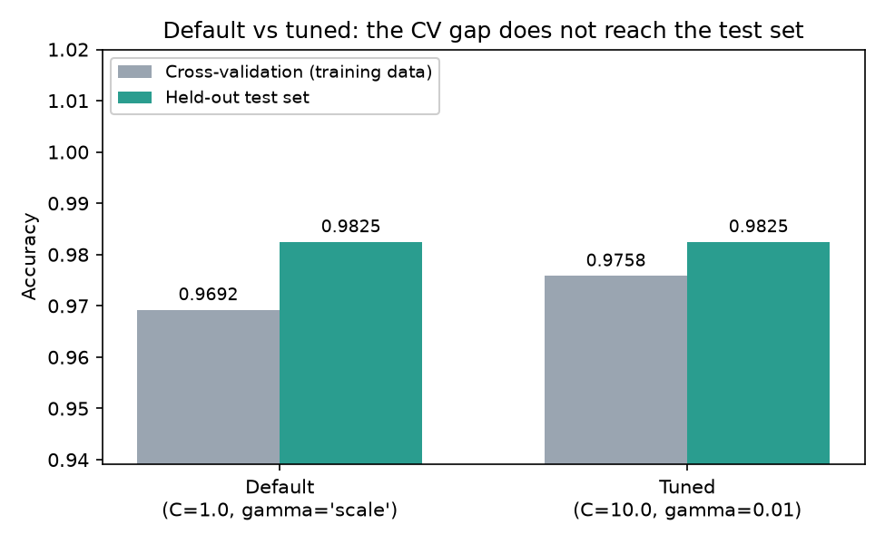

# Hyperparameter Tuning

Tuning is not finished when `GridSearchCV` reports a best score. This
page walks the whole workflow on one example: **search** a parameter
grid, **judge** the tuned result against the defaults where it counts —
on held-out data — then **use** the resulting model: save it to disk,
load it back, and predict.

## Setting up the search

Three decisions here matter more than the grid itself.

**Hold out a test set before tuning.** The cross-validated score inside
`GridSearchCV` is used to *choose* parameters, so it is no longer an
unbiased estimate of how the chosen model performs. Keeping a test set
aside gives you a number the search never saw.

**Put preprocessing inside a `Pipeline`.** Scaling the full dataset
before splitting leaks test statistics into training. A pipeline scales
within each CV fold, and — as the last section shows — it also means the
saved model carries its own preprocessing.

**Fix the folds explicitly.** A bare `cv=5` builds folds in row order,
which is a trap on any dataset that happens to be sorted; and every one
of the 16 combinations is scored on those same folds, so it is worth
deciding what they are rather than inheriting them.

```python
from sklearn.datasets import load_breast_cancer
from sklearn.model_selection import GridSearchCV, StratifiedKFold, train_test_split
from sklearn.pipeline import Pipeline
from sklearn.preprocessing import StandardScaler
from sklearn.svm import SVC

X, y = load_breast_cancer(return_X_y=True)
X_train, X_test, y_train, y_test = train_test_split(
    X, y, test_size=0.2, stratify=y, random_state=42)

CV = StratifiedKFold(5, shuffle=True, random_state=42)

pipe = Pipeline([("scaler", StandardScaler()),
                 ("svc", SVC(kernel="rbf"))])

param_grid = {
    "svc__C": [0.1, 1.0, 10.0, 100.0],        # 1.0     = sklearn default
    "svc__gamma": ["scale", 0.01, 0.1, 1.0],  # "scale" = sklearn default
}
grid = GridSearchCV(pipe, param_grid, cv=CV, refit=True, n_jobs=-1)
grid.fit(X_train, y_train)

print("train:", X_train.shape, " test:", X_test.shape)
print("best params:", grid.best_params_)
print(f"best CV score: {grid.best_score_:.4f}")
```

Output:

```text
train: (455, 30)  test: (114, 30)
best params: {'svc__C': 10.0, 'svc__gamma': 0.01}
best CV score: 0.9758
```

The `svc__` prefix is how a pipeline addresses a step's parameters:
`<step name>__<parameter>`.

`refit=True` is the default and is spelled out here because the rest of
the page depends on it: after the search finishes, scikit-learn refits
the winning configuration on the **whole training set** and stores it as
`best_estimator_`. Without it there is no fitted model to use, only a
table of scores.

!!! note "Why the defaults are inside the grid"
    `1.0` and `"scale"` are scikit-learn's defaults for `C` and
    `gamma`, so `cv_results_` shows where the out-of-the-box model
    ranks: **3rd of 16**, at 0.9692 against the winner's 0.9758. That is
    useful for the development narrative — it says the defaults were
    already in a good region — but it is not the comparison that decides
    anything. The next section explains why.

## The tuned model

`best_estimator_` is already trained, so there is nothing to rebuild:

```python
model = grid.best_estimator_
print(model)
```

Output:

```text
Pipeline(steps=[('scaler', StandardScaler()), ('svc', SVC(C=10.0, gamma=0.01))])
```

Note what came back: the entire **pipeline**, not just the `SVC`. It
carries its own `StandardScaler`, already fitted on the training data,
so it takes raw features and handles the scaling itself.

## Comparing against the defaults — on the test set

It is tempting to stop at `best_score_` versus the default row in
`cv_results_`. Both numbers come from the same folds, so they look
comparable, and the fold-to-fold spread is easy to quote as the caveat.
But fold noise is only half the problem, and it is the harmless half —
it pushes both ways.

The other half is systematic. `best_score_` is by definition the
**maximum of 16 scores measured on those exact folds**; the default's
score is one unselected number. Taking a maximum over candidates picks
up whatever fold-luck the winner happened to have, so the comparison
leans towards "tuned" every time, on every dataset, whether or not the
tuning helped. That bias does not average out with more folds.

The test set is already in hand, so the question can be settled where
every other question on these pages is settled. Fit the defaults on the
same training data and score both models on the test set:

```python
default_model = Pipeline([("scaler", StandardScaler()),
                          ("svc", SVC(kernel="rbf"))]).fit(X_train, y_train)

print(f"CV   — default 0.9692   tuned {grid.best_score_:.4f}")
print(f"Test — default {default_model.score(X_test, y_test):.4f}   "
      f"tuned {model.score(X_test, y_test):.4f}")
print("Test predictions that agree:",
      f"{(default_model.predict(X_test) == model.predict(X_test)).sum()}/{len(y_test)}")
```

Output:

```text
CV   — default 0.9692   tuned 0.9758
Test — default 0.9825   tuned 0.9825
Test predictions that agree: 114/114
```

### The bar chart

```python
import matplotlib.pyplot as plt
import numpy as np

cv_scores = [0.9692, grid.best_score_]
test_scores = [default_model.score(X_test, y_test), model.score(X_test, y_test)]
labels = ["Default\n(C=1.0, gamma='scale')", "Tuned\n(C=10.0, gamma=0.01)"]

x = np.arange(len(labels))
width = 0.35

fig, ax = plt.subplots(figsize=(6.5, 4))
b1 = ax.bar(x - width / 2, cv_scores, width, color="#9aa5b1",
            label="Cross-validation (training data)")
b2 = ax.bar(x + width / 2, test_scores, width, color="#2a9d8f",
            label="Held-out test set")
ax.set_xticks(x, labels)
ax.set_ylabel("Accuracy")
ax.set_ylim(min(cv_scores) - 0.03, 1.02)
ax.bar_label(b1, fmt="%.4f", padding=3, fontsize=9)
ax.bar_label(b2, fmt="%.4f", padding=3, fontsize=9)
ax.set_title("Default vs tuned: the CV gap does not reach the test set")
ax.legend(loc="upper left", fontsize=9, framealpha=0.95)
fig.tight_layout()
plt.show()
```

The result:



On the folds, tuning gains 0.66 accuracy points. On the test set it
gains nothing: both models score 0.9825, and they do not merely tie —
they make the **same prediction on all 114 test rows**. The grid search
was not wasted; it is how you learn that `C=1`, `gamma="scale"` was
already a good choice for this data. But "tuning improved the model" is
a claim the test set does not support here, and only the test set could
have told you that.

!!! note "About the truncated y-axis"
    The chart starts its y-axis near the scores to make the differences
    visible. When presenting results, always mention this — a truncated
    axis exaggerates differences, which is fine for inspection but can
    mislead in a report.

### What the tuned model does on the test set

```python
from sklearn.metrics import accuracy_score, classification_report

y_pred = model.predict(X_test)
print("accuracy:", round(accuracy_score(y_test, y_pred), 4))
print(classification_report(y_test, y_pred,
                            target_names=load_breast_cancer().target_names))
```

Output:

```text
accuracy: 0.9825
              precision    recall  f1-score   support

   malignant       0.98      0.98      0.98        42
      benign       0.99      0.99      0.99        72

    accuracy                           0.98       114
   macro avg       0.98      0.98      0.98       114
weighted avg       0.98      0.98      0.98       114
```

The test accuracy (0.9825) is *higher* than the cross-validated score
(0.9758). That is normal variation on 114 test samples, not evidence
that the model improved — with a test set this small, a single sample
moves accuracy by almost a percentage point.

## Using the tuned model

### Saving the model with `pickle`

Training is the expensive part; you do not want to repeat it every time
the model is used. Pickle serialises the fitted object to a file:

```python
import pickle
from pathlib import Path

out = Path("svc_breast_cancer.pkl")
with open(out, "wb") as f:
    pickle.dump(model, f)

print("saved:", out, f"({out.stat().st_size} bytes)")
```

Output:

```text
saved: svc_breast_cancer.pkl (15850 bytes)
```

Because `model` is the whole pipeline, that one file contains the
scaler's learned mean and variance *and* the trained SVC. Saving only
`model.named_steps["svc"]` would be a common and painful mistake — the
loaded classifier would then expect scaled input with no way to
reproduce the scaling.

### Loading it back and predicting

```python
with open("svc_breast_cancer.pkl", "rb") as f:
    loaded = pickle.load(f)

print("loaded:", type(loaded).__name__)
y_pred_loaded = loaded.predict(X_test)
print("identical predictions:", (y_pred_loaded == y_pred).all())
print("accuracy from loaded model:", round(accuracy_score(y_test, y_pred_loaded), 4))
```

Output:

```text
loaded: Pipeline
identical predictions: True
accuracy from loaded model: 0.9825
```

The loaded object behaves exactly like the original — same class, same
predictions. It can be used on genuinely new data the same way:

```python
new_samples = X_test[:5]          # stands in for unseen data
print("predicted:", loaded.predict(new_samples))
print("actual   :", y_test[:5])
```

Output:

```text
predicted: [0 1 0 1 0]
actual   : [0 1 0 1 0]
```

!!! warning "Two things to know about pickle"
    **Only unpickle files you trust.** Loading a pickle can execute
    arbitrary code, so a `.pkl` from an untrusted source is as dangerous
    as running an unknown script.

    **Pickles are not portable across versions.** A model saved under
    one scikit-learn version may fail to load, or load with subtly
    different behaviour, under another. Record the versions alongside
    the file — these results were produced with **scikit-learn 1.9.0**
    on **Python 3.13** — and pin them when the model matters.

    For long-lived models, `joblib.dump` / `joblib.load` is the
    scikit-learn recommendation: same interface, more efficient with the
    large NumPy arrays that fitted estimators contain.

## Comparing tuning strategies

`cv_results_` holds *every* combination, so the same object supports
richer development views without retraining: all 16 combinations sorted
by `mean_test_score`, or `C` pivoted against `gamma` as a heatmap. Those
are diagnostics — they describe the search, not the model.

Comparing grid search against another tuning strategy — the
metaheuristic search in
[Hyperparameter Optimization](parameter-optimization.md), say — needs
more care than "use the same cross-validation setup". That rule is
necessary but not sufficient, because both numbers are **maxima of
searches with different appetites**: 16 combinations here against 150
evaluations there. A greedier search digs up more fold-luck, so
comparing two CV maxima systematically favours whichever strategy looked
harder, independently of whether it found a better model.

This page and that one use the identical split and the identical folds,
so the two are directly comparable — and they show the pattern exactly:

| | Best CV score | Test accuracy |
|---|---|---|
| Default `SVC()` | 0.9692 | 0.9825 |
| Grid search, 16 combinations | 0.9758 | 0.9825 |
| ACO-R, 150 evaluations | 0.9780 | 0.9825 |

The CV column ranks the three exactly by how hard each one searched. The
test column, which is the one that answers the question anyone actually
asked, cannot tell them apart. A fair comparison of tuning strategies
therefore ends where this page ends: each strategy produces its final
configuration, both are refit on the same training data, and the verdict
comes from the test set.
