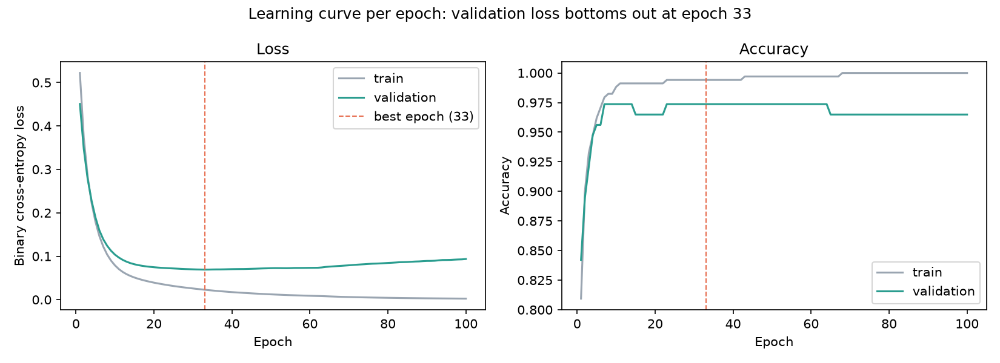
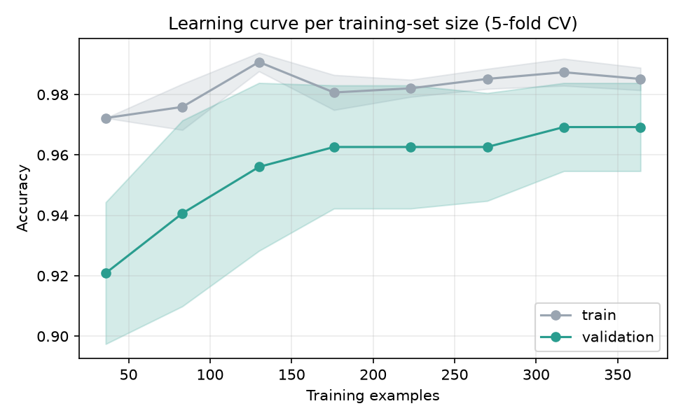

# Plotting Learning Curve

Two quite different plots go by the name *learning curve*, and they
answer different questions:

- **Per epoch** — how one training run unfolded. It diagnoses
  overfitting and underfitting, and tells you where the model should
  have stopped.
- **Per training-set size** — how the score responds to *more data*. It
  tells you whether collecting more rows is worth the effort.

This note draws both on the same dataset and is explicit about what each
one licenses you to conclude. For the metaheuristic analogue — best
score so far against iteration — see
[Plotting Convergence](convergence-plot.md).

!!! warning "Both curves live on development data"
    Everything below is computed from training and validation rows. A
    learning curve is a diagnostic you look at *while* building the
    model, so putting the test set on it would consume the one estimate
    you have left. The test set appears in neither plot.

## Setting up

The usual three-way split, with the scaler fitted on the training rows
only:

```python
import numpy as np
from sklearn.datasets import load_breast_cancer
from sklearn.model_selection import train_test_split
from sklearn.preprocessing import StandardScaler

X, y = load_breast_cancer(return_X_y=True)
X_dev, X_test, y_dev, y_test = train_test_split(
    X, y, test_size=0.2, stratify=y, random_state=42)
X_train, X_val, y_train, y_val = train_test_split(
    X_dev, y_dev, test_size=0.25, stratify=y_dev, random_state=42)

scaler = StandardScaler().fit(X_train)
X_train, X_val, X_test = (scaler.transform(a) for a in (X_train, X_val, X_test))
print("train:", X_train.shape, " val:", X_val.shape, " test:", X_test.shape)
```

Output:

```text
train: (341, 30)  val: (114, 30)  test: (114, 30)
```

## Curve 1 — loss and accuracy per epoch

Keras returns a `History` object from `fit`. Its `.history` is a plain
dict of lists, one entry per metric per epoch — that dict *is* the
learning curve; plotting is just presentation.

```python
from tensorflow import keras

keras.utils.set_random_seed(0)
model = keras.Sequential([
    keras.layers.Input(shape=(X_train.shape[1],)),
    keras.layers.Dense(32, activation="relu"),
    keras.layers.Dense(16, activation="relu"),
    keras.layers.Dense(1, activation="sigmoid"),
])
model.compile(optimizer="adam", loss="binary_crossentropy", metrics=["accuracy"])

history = model.fit(X_train, y_train,
                    validation_data=(X_val, y_val),   # <- the val curve needs this
                    epochs=100, batch_size=32, verbose=0)

hist = history.history
best_epoch = int(np.argmin(hist["val_loss"])) + 1

print("recorded:", list(hist))
print("best epoch (lowest val_loss):", best_epoch)
print(f"val_loss at best epoch  : {min(hist['val_loss']):.4f}")
print(f"val_loss at last epoch  : {hist['val_loss'][-1]:.4f}")
print(f"train loss at last epoch: {hist['loss'][-1]:.4f}")
```

Output:

```text
recorded: ['accuracy', 'loss', 'val_accuracy', 'val_loss']
best epoch (lowest val_loss): 33
val_loss at best epoch  : 0.0692
val_loss at last epoch  : 0.0936
train loss at last epoch: 0.0024
```

Passing `validation_data=` is what makes this a learning curve rather
than a training log: without it there is no `val_loss`, and a curve of
training loss alone cannot show overfitting at all — it goes down
either way.

```python
import matplotlib.pyplot as plt

epochs = range(1, len(hist["loss"]) + 1)

fig, (ax1, ax2) = plt.subplots(1, 2, figsize=(11, 4))

ax1.plot(epochs, hist["loss"], label="train", color="#9aa5b1")
ax1.plot(epochs, hist["val_loss"], label="validation", color="#2a9d8f")
ax1.axvline(best_epoch, color="#e76f51", linestyle="--", linewidth=1,
            label=f"best epoch ({best_epoch})")
ax1.set_xlabel("Epoch")
ax1.set_ylabel("Binary cross-entropy loss")
ax1.set_title("Loss")
ax1.legend()

ax2.plot(epochs, hist["accuracy"], label="train", color="#9aa5b1")
ax2.plot(epochs, hist["val_accuracy"], label="validation", color="#2a9d8f")
ax2.axvline(best_epoch, color="#e76f51", linestyle="--", linewidth=1)
ax2.set_xlabel("Epoch")
ax2.set_ylabel("Accuracy")
ax2.set_title("Accuracy")
ax2.legend(loc="lower right")

fig.suptitle("Learning curve per epoch: validation loss bottoms out at epoch 33")
fig.tight_layout()
plt.show()
```

The result:



### How to read it

- **The fork is the finding.** For the first dozen epochs both losses
  fall together. The validation loss then flattens, reaches its minimum
  of 0.0692 at epoch 33, and climbs back to 0.0936 — while the training
  loss keeps falling all the way to 0.0024, which is essentially
  memorisation. Everything to the right of the dashed line is the model
  learning things that are true of these 341 rows and of nothing else.
- **The last epoch is not the model.** Reporting the final `val_loss`
  of 0.0936 would describe a network 67 epochs past its best. The
  number worth quoting is 0.0692, at epoch 33 — which is why fitness
  functions on the
  [Hyperparameter Optimization](parameter-optimization.md) page use
  `min(history.history["val_loss"])` and an `EarlyStopping` callback
  with `restore_best_weights=True`.
- **Accuracy hides what loss shows.** In the right-hand panel, after
  the first ten epochs the validation accuracy moves inside a band about
  one point wide and never clearly turns. Accuracy only counts which
  side of 0.5 a prediction fell on; loss also counts *how confidently*
  it was wrong, which is why the same overfitting is obvious in one
  panel and invisible in the other. Diagnose with loss.
- **What underfitting would look like instead:** both curves flat and
  high, close together, still falling when the run ends. That is a
  signal to train longer, or to use a larger model — the opposite
  prescription from the plot above.

!!! note "Without Keras"
    `ikn-library` does not require TensorFlow; install it separately to
    run this section (`pip install tensorflow`). scikit-learn's
    `MLPClassifier` exposes the same information more narrowly:
    `loss_curve_` after any fit, plus `validation_scores_` when it is
    constructed with `early_stopping=True`. Estimators that do not train
    iteratively — SVC, random forests, KNN — have no per-epoch curve at
    all; for those, curve 2 is the learning curve.

## Curve 2 — score per training-set size

This one asks a question no single training run can answer: *would more
data help?* scikit-learn's `learning_curve` answers it by refitting the
estimator on nested subsets of the data and cross-validating each one.

```python
from sklearn.model_selection import StratifiedKFold, learning_curve
from sklearn.pipeline import make_pipeline
from sklearn.svm import SVC

CV = StratifiedKFold(5, shuffle=True, random_state=42)
pipe = make_pipeline(StandardScaler(), SVC(kernel="rbf"))

sizes, train_scores, val_scores = learning_curve(
    pipe, X_dev, y_dev, cv=CV,
    train_sizes=np.linspace(0.1, 1.0, 8), n_jobs=-1)

print("n_train  train_acc   val_acc")
for n, tr, va in zip(sizes, train_scores.mean(axis=1), val_scores.mean(axis=1)):
    print(f"{n:>7}    {tr:.4f}    {va:.4f}")
```

Output:

```text
n_train  train_acc   val_acc
     36    0.9722    0.9209
     83    0.9759    0.9407
    130    0.9908    0.9560
    176    0.9807    0.9626
    223    0.9821    0.9626
    270    0.9852    0.9626
    317    0.9874    0.9692
    364    0.9852    0.9692
```

Note the two arguments doing the real work. `X_dev` is the raw,
unscaled development set: the scaler is inside the pipeline, so it is
refitted on each subset rather than on data the fold has not earned.
And `CV` is an explicit shuffled `StratifiedKFold`, so every point on
the curve is measured on the same folds — the same discipline as the
[Hyperparameter Tuning](gridsearch-comparison.md) page.

```python
fig, ax = plt.subplots(figsize=(6.5, 4))

for scores, label, color in ((train_scores, "train", "#9aa5b1"),
                             (val_scores, "validation", "#2a9d8f")):
    mean, std = scores.mean(axis=1), scores.std(axis=1)
    ax.plot(sizes, mean, "o-", color=color, label=label)
    ax.fill_between(sizes, mean - std, mean + std, color=color, alpha=0.2)

ax.set_xlabel("Training examples")
ax.set_ylabel("Accuracy")
ax.set_title("Learning curve per training-set size (5-fold CV)")
ax.grid(alpha=0.25)
ax.legend(loc="lower right")
fig.tight_layout()
plt.show()
```

The result:



### How to read it

- **The validation curve rises, then flattens.** From 36 rows to 364 it
  gains 4.8 accuracy points, but almost all of that arrives by 176
  rows; the last 188 rows buy 0.66 points. The flattening is the
  answer to the question: collecting more rows *of the same kind* would
  buy very little here.
- **The shaded bands are fold spread, and they matter.** At the largest
  size the gap between the two curves is 0.0159 while the validation
  fold-to-fold standard deviation is 0.0146 — about the same size. Do
  not read a gap you cannot distinguish from noise as evidence of
  overfitting.
- **A curve still climbing at the right edge means the opposite.** It
  says the model is data-limited, and more rows are the cheapest
  available improvement — cheaper than a bigger model or more tuning.
- **A training curve that sags towards the validation curve at high
  bias** — both low, both flat, meeting early — says the model is too
  simple for the data, and more rows will not fix it.

## Which curve answers which question

| The question | The curve |
|---|---|
| Am I overfitting? | Per epoch: the fork between train and validation loss |
| How long should I train? | Per epoch: the epoch where validation loss bottoms out |
| Is my model too simple? | Per size: both curves low and flat, meeting early |
| Would more data help? | Per size: is the validation curve still climbing? |
| Is my *search* converging? | Neither — see [Plotting Convergence](convergence-plot.md) |

Neither curve reports how good the model is. That number comes from the
test set, once, at the end — see
[Hyperparameter Tuning](gridsearch-comparison.md#comparing-against-the-defaults-on-the-test-set).
