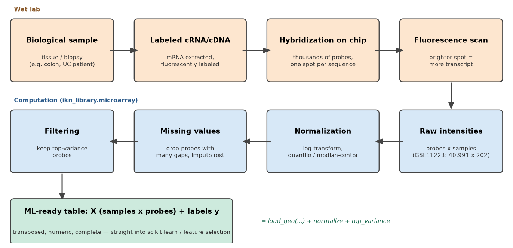

# Microarray Data Concept

This note explains what microarray data actually *is* — where it comes
from, what its numbers mean, and how it becomes the tabular
``samples × features`` matrix that machine-learning methods expect.
The practical loading and preprocessing API is on the
[Microarray Data](microarray.md) page.

## What is microarray data?

A DNA **microarray** ("gene chip") is a glass slide carrying thousands
of microscopic spots, each holding copies of one known DNA sequence — a
**probe**. To measure a sample:

1. mRNA is extracted from the biological sample (a tissue biopsy, a
   cell culture) and converted into fluorescently labeled cDNA/cRNA.
2. The labeled material is washed over the chip. Each molecule
   **hybridizes** — binds — to the probe carrying its complementary
   sequence.
3. A scanner reads the fluorescence of every spot: the brighter a
   spot, the more of that transcript the sample contained.

One chip therefore measures the activity of **tens of thousands of
genes simultaneously** in a single experiment — that scale is the whole
point of the technology.



## What does the data represent?

Each number is an estimate of **gene expression**: how actively a gene
was being transcribed into mRNA in that sample at that moment. A
microarray dataset is a snapshot of the transcriptional state of the
tissue — which is why comparing, say, ulcerative-colitis biopsies with
healthy ones can reveal disease-related genes.

Details worth knowing when you model this data:

- **Probes are not genes.** A probe targets one sequence; a gene is
  often covered by several probes, and some probes map to no or to
  outdated gene annotations. ML pipelines usually work at the probe
  level and map to genes only when interpreting results.
- **The values' scale depends on the platform.** One-color chips (e.g.
  Affymetrix) yield intensities — positive numbers, usually
  log2-transformed during preprocessing. Two-color chips (e.g. the
  Agilent platform of GSE11223) yield **log ratios** of sample vs
  reference — values around zero, negative meaning *lower* expression
  than the reference. This is why
  [`log2_transform`](microarray.md#normalization) refuses negative
  input: such data is already on a log scale.
- **It is noisy and high-dimensional.** Technical variation between
  chips, missing spots, and far more probes than samples
  (GSE11223: 202 samples × ~41,000 probes) are the norm, not the
  exception — the classic *p >> n* setting that motivates feature
  selection.

## How do you obtain microarray data?

Almost all published microarray studies deposit their data in public
repositories:

- **NCBI GEO** (Gene Expression Omnibus) — the largest one, and what
  `ikn_library.microarray` reads. Three accession types matter:
  **GPL** identifies the *platform* (the chip design), **GSM** one
  *sample* (one chip run), and **GSE** a *series* (a whole study, e.g.
  [GSE11223](https://www.ncbi.nlm.nih.gov/geo/query/acc.cgi?acc=GSE11223):
  202 colon biopsies on platform GPL1708).
- **ArrayExpress** (EMBL-EBI) — the European counterpart.

For ML work, the most convenient download is the **series matrix
file**: one text file per series bundling the normalized expression
table (probes × samples) with per-sample metadata (diagnosis, tissue,
age, ...) in its header. That is exactly the file

```python
from ikn_library.microarray import load_geo

data = load_geo("GSE11223")   # downloads once, caches locally
```

fetches and parses for you. (The alternative — raw per-chip files such
as Affymetrix CEL — offers more control over preprocessing but requires
platform-specific pipelines; series matrices are already normalized by
the submitters.)

## From raw data to a tabular dataset

The path from scanner output to an ML-ready table, and where each step
lives in this library:

1. **Image → intensities.** The scanner quantifies each spot;
   background signal is subtracted. Already done in a series matrix.
2. **Within-array transform.** Intensities are log-transformed
   (`log2_transform` for raw linear data) or expressed as log ratios,
   so fold-changes become additive and the distribution roughly
   symmetric.
3. **Between-array normalization.** Chips differ in overall brightness;
   [`quantile_normalize`](microarray.md#normalization) (or the lighter
   `median_center`) makes samples comparable.
4. **Missing values.** Failed spots become gaps (GSE11223 has ~217,000
   `null` cells). Drop probes with too many gaps
   (`dropna_threshold=0.1`) and impute the rest (`impute="mean"`).
5. **Orientation.** The file stores probes as rows; ML expects samples
   as rows. `load_geo` transposes, giving `X` of shape
   ``(n_samples, n_probes)``.
6. **Labels.** The header's characteristics fields (e.g.
   `disease: UC`) become the metadata table; `data.y("disease")`
   extracts them as the target vector.
7. **Dimensionality.** ~41,000 probes for 202 samples invites
   overfitting; an unsupervised variance filter (`top_variance`) keeps
   the most informative probes, and wrapper
   [feature selection](feature-selection.md) can then pick the final
   subset.

After step 7 the data is an ordinary numeric table plus a label vector
— from that point on, microarray analysis *is* ordinary machine
learning, with one caveat: with so few samples, honest evaluation
protocols (cross-validation, held-out test sets) matter even more than
usual.
