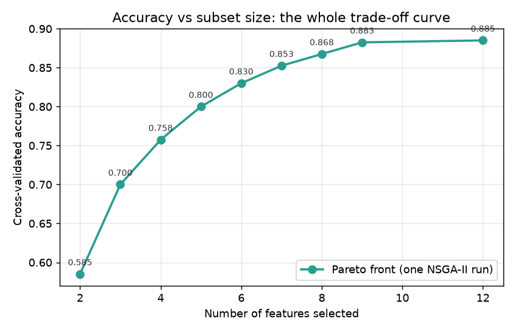

# Multi-Objective Optimization

Most real problems pull in two directions at once. Feature selection
wants high accuracy *and* few features; a drug candidate should be
potent *and* non-toxic; a diagnostic test needs sensitivity *and*
specificity. `ikn_library.multiobjective` optimizes such goals
**without collapsing them into one number**, returning the whole
trade-off curve — the **Pareto front** — in a single run.

## The problem with weighted sums

[`FeatureSelectionProblem`](feature-selection.md) folds two goals into
one fitness:

```
alpha * (1 - accuracy) + (1 - alpha) * n_selected / n_features
```

That forces you to pick `alpha` *before* the search, even though no
principled value exists — and each choice yields a different answer, so
you end up re-running the whole optimization to explore the trade-off.
On the breast-cancer dataset, four values of `alpha` gave four
different subsets (5, 3, 4, and 2 features) at four separate runs.

## Pareto dominance

Solution **A dominates B** when A is no worse in every objective and
strictly better in at least one. The **Pareto front** is the set of
solutions no other solution dominates.

- 5 features / 95.1% vs 4 features / 94.7% → *neither dominates*; one
  is more accurate, the other smaller. Both are legitimate answers.
- 4 features / 95.2% would dominate 5 features / 95.1% — fewer
  features *and* more accurate, so the latter becomes irrelevant.

The front is exactly the menu a domain expert needs: pick the point
that fits the clinical or budgetary context, after seeing what each
subset size actually buys.

## NSGA-II

[`NSGA2`][ikn_library.algorithms.NSGA2] (Deb et al., 2002) finds that
whole front in one run using three mechanisms that replace
single-objective ranking:

1. **Non-dominated sorting** ranks the population into fronts: front 0
   is non-dominated, front 1 is dominated only by front 0, and so on.
2. **Crowding distance** breaks ties *within* a front, favouring
   solutions in sparsely populated regions so the front spreads out
   instead of clustering at one end.
3. **Elitist replacement** merges parents and offspring and refills the
   next generation front by front, so no Pareto solution is ever lost.

## Usage

```python
from ikn_library.multiobjective import (
    MultiObjectiveFeatureSelection, MultiObjectiveTask,
)
from ikn_library.algorithms import NSGA2

problem = MultiObjectiveFeatureSelection(X, y, cv=5)
task = MultiObjectiveTask(problem=problem, max_evals=4000)
solutions, objectives = NSGA2(population_size=40, seed=42).run(task)

for solution, (error, fraction) in zip(solutions, objectives):
    features = problem.selected_features(solution)
    print(len(features), 1 - error, list(features))
```

Note what `run()` returns here: **two arrays**, not one best solution.
`objectives[i]` holds the objective values of `solutions[i]`, sorted by
the first objective.

## Example: the whole trade-off curve at once

On a synthetic dataset (400 samples, 30 features, 12 informative), one
NSGA-II run produces:



```text
n_features | CV accuracy
-----------|------------
     2     |   0.5850
     3     |   0.7000
     4     |   0.7575
     5     |   0.8000
     6     |   0.8300
     7     |   0.8525
     8     |   0.8675
     9     |   0.8825
    12     |   0.8850
```

The curve makes the decision obvious in a way no single `alpha` could:
accuracy climbs steeply up to about 9 features, then flattens — the
last three features buy 0.25 percentage points. A clinician paying per
assay would stop at 8 or 9.

!!! tip "A smaller subset can be just as good"
    On the breast-cancer data, NSGA-II found a **2-feature** subset with
    95.08% accuracy — matching the *5-feature* subset that the
    weighted-sum version returned with `alpha=0.99`. Optimizing the
    objectives separately exposed a solution the scalarized version
    never surfaced.

## Using the selected features to train a model

A Pareto front is a menu, not an answer. Three steps turn it into a
working model.

!!! warning "Run the selection on training data only"
    Feature selection is part of model building, so it must not see the
    test set. Split first, optimize on the training split, and keep the
    test split untouched for the final number — otherwise the reported
    accuracy is optimistic.

```python
from sklearn.model_selection import train_test_split
from sklearn.neighbors import KNeighborsClassifier
from sklearn.metrics import accuracy_score

X_train, X_test, y_train, y_test = train_test_split(
    X, y, test_size=0.3, stratify=y, random_state=42)

# 1. Build the front from the TRAINING data
problem = MultiObjectiveFeatureSelection(X_train, y_train, cv=5)
solutions, objectives = NSGA2(population_size=40, seed=42).run(
    MultiObjectiveTask(problem=problem, max_evals=3000))
```

**Step 2 — pick a point on the front.** Three common criteria:

```python
import numpy as np

n_features = np.array([len(problem.selected_features(s)) for s in solutions])
cv_accuracy = 1 - objectives[:, 0]

most_accurate = int(np.argmax(cv_accuracy))     # best score, size ignored
smallest = int(np.argmin(n_features))           # fewest features
# or: the smallest subset meeting a required accuracy
budget = np.flatnonzero(cv_accuracy >= 0.85)
cheapest_good_enough = budget[np.argmin(n_features[budget])]
```

**Step 3 — extract the features and fit the final model.** The solution
vector is a mask, so `selected_features` gives the column indices:

```python
features = problem.selected_features(solutions[most_accurate])

model = KNeighborsClassifier(n_neighbors=5)
model.fit(X_train[:, features], y_train)
accuracy = accuracy_score(y_test, model.predict(X_test[:, features]))
```

Note that **the same column indices must be applied to any future
data** — store `features` alongside the model.

### What it gives you

Running exactly that on the synthetic dataset above:

```text
all 30 features            : test accuracy = 0.8333
most accurate  (11 features): test accuracy = 0.8583
knee point      (5 features): test accuracy = 0.6667
smallest        (2 features): test accuracy = 0.6333
```

The 11-feature subset **beats using all 30** — higher accuracy from a
third of the inputs, which is the payoff feature selection promises.

!!! warning "The knee point is a heuristic, not a rule"
    A popular shortcut is to take the *knee* — the point of maximum
    curvature, where accuracy stops climbing steeply. Here that picked
    5 features and scored **0.6667 on the test set**, far below both the
    11-feature subset and using everything.

    The knee is a property of the *shape* of the training-CV curve, and
    that shape does not have to reflect generalization. Treat the front
    as a shortlist: check the candidates you care about on held-out
    data before committing.

## Writing your own multi-objective problem

Subclass `MultiObjectiveProblem` and return a vector; **every objective
is minimized**, so maximize accuracy by returning `1 - accuracy`:

```python
import numpy as np
from ikn_library.multiobjective import MultiObjectiveProblem

class PotencyAndToxicity(MultiObjectiveProblem):
    def __init__(self, dimension):
        super().__init__(dimension, n_objectives=2, lower=0.0, upper=1.0,
                         objective_names=["1 - potency", "toxicity"])

    def _evaluate(self, x):
        return np.array([1.0 - potency(x), toxicity(x)])
```

## Pareto utilities

The building blocks are public, so you can analyse any set of results:

```python
from ikn_library.multiobjective import (
    dominates, non_dominated_sort, crowding_distance, pareto_front,
)

dominates([1, 1], [2, 2])            # True
non_dominated_sort(objectives)       # list of fronts (index arrays)
crowding_distance(objectives)        # spread measure within one front
pareto_front(solutions, objectives)  # keep the non-dominated ones
```

`pareto_front` deduplicates by default: discrete objectives (a feature
count, a number of ensemble members) produce many solutions that land
on identical objective values, and keeping them all would bloat the
front and distort crowding distances.

## Reference

K. Deb, A. Pratap, S. Agarwal, and T. Meyarivan, "A fast and elitist
multiobjective genetic algorithm: NSGA-II," *IEEE Transactions on
Evolutionary Computation*, 6(2), 182-197, 2002.
[doi:10.1109/4235.996017](https://doi.org/10.1109/4235.996017).
